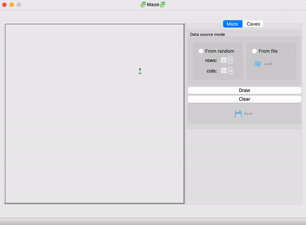
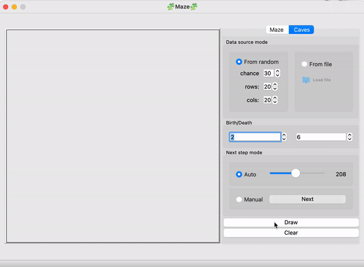

# CPP_Maze-Cave
## Лабиринт

Лабиринт с "тонкими стенками" представляет собой таблицу размером _n_ строк на _m_ столбцов. 
Между ячейками таблицы могут находиться "стены". Также "стенами" окружена вся таблица в целом. 
Решением лабиринта считается кратчайший путь от заданной начальной точки (ячейки таблицы) до конечной. 
При прохождении лабиринта можно передвигаться к соседним ячейкам, не отделенным "стеной" от текущей ячейки и находящимся сверху, снизу, справа или слева. 
Кратчайшим маршрут считается, если он проходит через наименьшее число ячеек.
Лабиринт может храниться в файле в виде количества строк и столбцов, а также двух матриц, содержащих положение вертикальных и горизонтальных стен соответственно. 
В первой матрице отображается наличие стены справа от каждой ячейки, а во второй - снизу. 

Пример подобного файла:  
```
4 4
0 0 0 1
1 0 1 1
0 1 0 1
0 0 0 1

1 0 1 0
0 0 1 0
1 1 0 1
1 1 1 1
```
### Автоматическая генерация идеального лабиринта.
Идеальным считается лабиринт, в котором из каждой точки можно попасть в любую другую точку ровно одним способом.
- Генерация происходит согласно **алгоритму Эллера**
- Сгенерированный лабиринт не имеет изолированных областей и петель
- Пользователем вводится только размерность лабиринта: количество строк и столбцов
- Сгенерированный лабиринт может сохраняться в файл



### Решение лабиринта
- Пользователем задаются начальная и конечная точки
- Маршрут, являющийся решением, отображается линией толщиной 2 пикселя, проходящей через середины всех ячеек лабиринта, через которые пролегает решение

## Пещера
### Генерация с использованием клеточного автомата
Во многих играх есть необходимость в ветвящихся локациях, например пещерах. 
Такие локации могут быть созданы генерацией с использованием клеточного автомата. 
Алгоритм состоит в реализации двух шагов: 
  - Сначала все поле заполняется случайным образом стенами — т.е. для каждой клетки случайным образом определяется, 
будет ли она свободной или непроходимой.
  - Несколько раз происходит обновление состояния карты в соответствии с условиями, 
похожими на условия рождения/смерти в «Жизни».

### Описание пещер

Пещера, прошедшая 0 шагов симуляции (только инициализированная), может храниться в файле в виде количества строк и столбцов, 
а также матрицы, содержащей положение "живых" и "мертвых" клеток.

Пример подобного файла:
```
4 4
0 1 0 1
1 0 0 1
0 1 0 0
0 0 1 1
```


### Генерация пещер
- Пользователем выбирается файл, в котором описан пещера по описанному [выше](#описание-пещер) формату
- Максимальный размер пещеры - 100 х 100
- Загруженная пещера будет отрисована на экране в поле размером 500 x 500 пикселей
- Пользователем задаются пределы "рождения" и "смерти" клетки, а также шанс на начальную инициализацию клетки
- Пределы "рождения" и "смерти" могут иметь значения от 0 до 7
- Предусмотрен пошаговый режим отрисовки результатов работы алгоритма в двух вариантах:
  - По нажатию на кнопку следующего шага отрисовывается очередная итерация работы алгоритма
  - По нажатию на кнопку автоматической работы запускается отрисовка итераций работы алгоритма с частотой 1 шаг в `N` миллисекунд, где число миллисекунд `N` задаётся через специальное поле в пользовательском интерфейсе
- Размер клеток в пикселях вычисляется таким образом, чтобы пещера занимала всё отведенное под него поле
